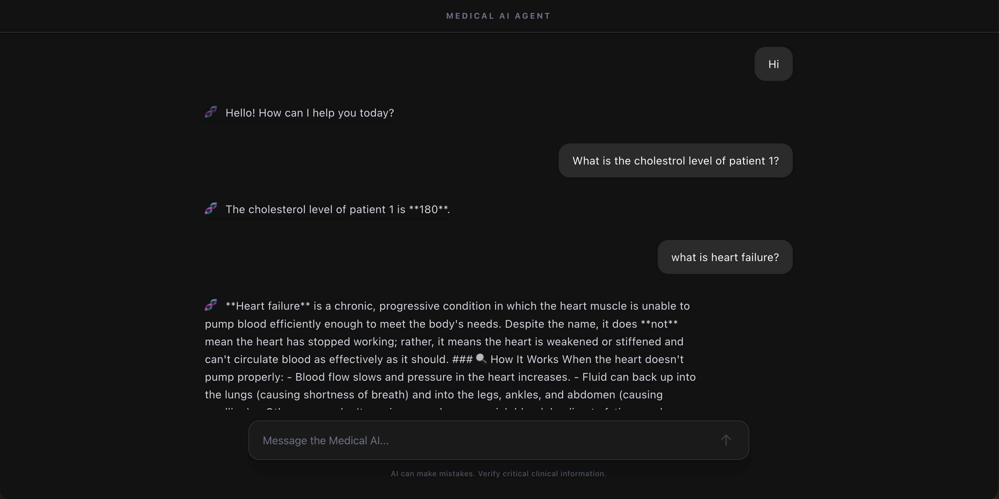

# 🧬 Medical AI Knowledge Agent

A full-stack AI agent that intelligently routes natural language queries between a structured SQL database (patient metrics) and an unstructured vector database (clinical documents). Packaged as decoupled microservices in Docker containers and deployed on AWS EC2.

---

## 📸 Demo

*Live deployment on AWS EC2 (eu-north-1) — natural language input → autonomous tool selection → real-time SQL or RAG response*

---

## 🏗️ System Architecture

```
+---------------------------------+
|         Next.js Web GUI         |
|      (Port 3000 - Chat UI)      |
+---------------------------------+
                |
                | HTTP POST /chat (User Query)
                v
+---------------------------------+
|         FastAPI Backend         |
|    (Port 8000 - API Router)     |
+---------------------------------+
                |
                | LangGraph Tool Routing
                v
+---------------------------------+
|       AI Inference Engine       |
|  (Groq LLM + LangGraph Agent)   |
+---------------------------------+
           /              \
     SQL Tool            RAG Tool
          v                 v
+----------------+  +----------------+
| SQLite Patient |  | ChromaDB Vector|
| Database       |  | Index (PDFs)   |
+----------------+  +----------------+
```

1. **Frontend (Next.js):** Modern chat interface for interacting with the AI agent in real time.
2. **Backend (FastAPI + LangGraph):** Asynchronous API that receives queries and uses an LLM to autonomously decide whether to execute a SQL query or a vector similarity search — the agent picks the right tool without being told.
3. **Databases:** SQLite for structured patient tabular data; ChromaDB for unstructured medical PDF knowledge.
4. **Containerisation:** Multi-container setup via Docker Compose V2, optimised for resource-constrained cloud environments (AWS EC2 `t3.micro`).

---

## 📊 Agent Capabilities

| Capability | Detail |
|---|---|
| Structured queries | SQL via Pandas — patient counts, cholesterol levels, tabular filtering |
| Unstructured queries | RAG via ChromaDB + HuggingFace embeddings — clinical definitions, medical guidelines from PDFs |
| Autonomous routing | LangGraph agent selects SQL or RAG based on query intent — no manual switching |
| Session memory | Conversation context persists across turns within a session |
| Deployment | Live on AWS EC2 — Docker Compose orchestrated, swap-optimised for free tier |

---

## 🛠️ Tech Stack

| Layer | Technology |
|---|---|
| AI & Orchestration | LangChain, LangGraph, Groq API, HuggingFace Embeddings |
| Databases | ChromaDB (vector), SQLite, Pandas |
| API | FastAPI, Uvicorn |
| Frontend | Next.js, React, Node.js, Tailwind CSS |
| Containerisation | Docker, Docker Compose V2 |
| Cloud | AWS EC2 (Ubuntu Linux, eu-north-1) |

---

## 📁 Repository Structure

```
medical-knowledge-agent/
│
├── data/                        # Vector DB and SQLite — generated locally
│   ├── chroma_db/               # ChromaDB embeddings (git-ignored)
│   └── patient_db.db            # SQLite patient database (git-ignored)
├── logs/                        # Application and container runtime logs
├── src/
│   ├── agent.py                 # LangGraph tool definitions and routing logic
│   ├── app.py                   # Backend entry point
│   ├── rag_tool.py              # RAG retrieval pipeline
│   ├── rag_test.py              # Unit tests for vector retrieval
│   ├── server.py                # FastAPI endpoints and CORS configuration
│   ├── setup_db.py              # PDF ingestion and SQLite initialisation
│   └── test_db.py               # Database connection validation
├── frontend/
│   ├── public/                  # Static assets
│   └── src/app/
│       ├── page.js              # Main chat UI component
│       ├── layout.js            # Next.js root layout
│       └── globals.css          # Tailwind and global styles
├── Dockerfile.backend           # Docker image — FastAPI backend
├── Dockerfile.frontend          # Docker image — Next.js frontend
├── docker-compose.yml           # Container orchestration
├── requirements.txt             # Python dependencies (CPU-optimised)
└── README.md
```

> **Data note:** The `data/` directory is generated dynamically on the host using `setup_db.py` and mounted into containers at runtime — keeping the Docker image lean and protecting sensitive data.

---

## 🚀 How to Run

### Prerequisites

- Docker and Docker Compose V2 installed
- A [Groq API key](https://console.groq.com) (free)

### Local Setup

```bash
git clone https://github.com/sachinkumarp-code/medical-knowledge-agent
cd medical-knowledge-agent

# Create a .env file with your API key
echo "GROQ_API_KEY=your_key_here" > .env

# Initialise databases locally (run once)
python src/setup_db.py

# Launch the full stack
docker compose up --build -d
```

Open `http://localhost:3000` in your browser.

### Example Queries

```
"How many patients have cholesterol above 250?"      → SQL tool
"What is the definition of cardiac allograft rejection?"  → RAG tool
"Summarise the treatment guidelines for heart failure"    → RAG tool
```

---

## ☁️ AWS Deployment — Resource Optimisations

Deployed on EC2 `t3.micro` (1 vCPU, 1 GB RAM). Three optimisations prevent OOM crashes on free-tier hardware:

1. **Virtual RAM** — configured a permanent 4 GB `/swapfile` on the instance
2. **CPU-only PyTorch** — forced via `--extra-index-url https://download.pytorch.org/whl/cpu` in `requirements.txt`, saving over 5 GB compared to the default GPU build
3. **Runtime data injection** — databases initialised after container startup via `docker exec -it medical-knowledge-agent-backend-1 python src/setup_db.py`, keeping the Docker image itself lean

---

## 🔬 Part of a Larger Medical AI Portfolio

| Project | Description |
|---|---|
| **Medical AI Knowledge Agent** (this repo) | Autonomous RAG + SQL agent with Next.js UI |
| [Brain Tumor MLOps](https://github.com/sachinkumarp-code/brain-tumor-classification) | PyTorch CNN deployed live on AWS EC2 via FastAPI + Streamlit + Docker |
| 🔒 Cardiac Histopathology Segmentation | Attention UNet, active learning, 6,600+ WSIs — ongoing thesis (confidential) |

---

## 👤 Author

**Sachinkumar P** — M.Tech., Structural & Computational Biology, IIT Roorkee  
[github.com/sachinkumarp-code](https://github.com/sachinkumarp-code) · [LinkedIn](https://www.linkedin.com/in/sachin-kumar-965542247/)